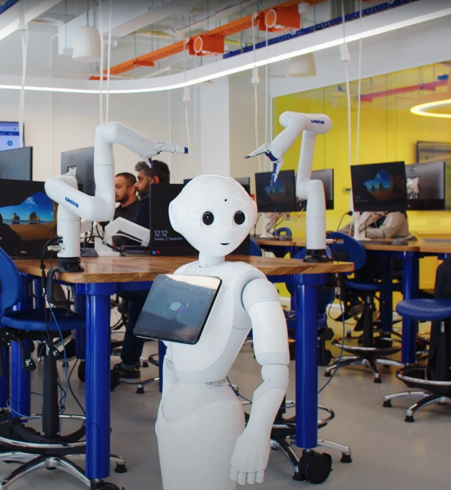

# Foundations of Robotics Lab Notebooks

[](<https://mybinder.org/v2/gh/CollaborativeRoboticsLab/foundations-of-robotics-labs/HEAD>)
[](<https://colab.research.google.com/github/CollaborativeRoboticsLab/foundations-of-robotics-labs>)
[](https://open.vscode.dev/CollaborativeRoboticsLab/foundations-of-robotics-labs)
[](https://docs.ros.org/en/jazzy/)

These Python Jupyter notebooks are designed for academic teaching laboratories in robotics, using Gazebo for simulation up to physical deployment on robotic platforms. The students are not expected to install or deploy the required ROS workspace on their personal computer, but rather use lab resources at the university. The laboratories were originally designed at École de technologie supérieure, in Montréal, Canada, and  have been heavily adapted for the University of Canberra. Robotic platforms are available for the students to test their algorithms along with shared laptop stations.



## Prerequisites

The notebooks are designed to be used with a ROS workspace that contains the following packages:

- [Sphero RVR ROS](<https://github.com/CollaborativeRoboticsLab/sphero_rvr_ros>) - ROS packages for the Sphero RVR

## Projects

- [**Part I 2-5: Foundations**](<./week-2/readme.md>) - Primers on Python, the terminal, and ROS, Feedback & Robotic algorithm fundamentals
- [**Part II 6-8: Mobile Robots**](<./week-5/readme.md>) - Localization, Navigation & Mapping
- [**Part III 10-12: Robot Manipulation**](<./week-10/readme.md>) - Kinematics for a Robot Manipulator

## Installation

### ROS

The software requires ROS to be installed to use the `rclpy` libraries. Follow the instructions for ROS `jazzy` on the [official website](https://ros.org).

### Virtual Environment

Setting up a python virtual environment for can be useful in some development situations. Run the following command in a terminal at the top level of this git repository.

```python
# create virtual environment
python3 -m venv .venv

# linux
source .venv/bin/activate

pip install -r requirements.txt
```

### Running the code

The code is provided as [Jupyter notebooks](https://jupyter.org). In a terminal at the top level of this git repository, run the following.

```bash
source .venv/bin/activate

# start a jupyter notebook server
jupyter lab --ip=0.0.0.0 --port=8888
# open a web browser to the address provided in the terminal
# for example: http://localhost:8888/lab?token=...
```

### Docker

A Dockerfile is provided to run the notebooks in a container. To build the container, run the following command in a terminal at the top level of this git repository.

```bash
# build the docker container
docker build -t frlab -f .binder/Dockerfile .

# run the docker container
docker run -p 8888:8888 frlab jupyter lab --ip=0.0.0.0 --port=8888

# for graphical applications, run the following command instead
xhost +local:root && \
docker run --rm --network host --device /dev/dri -e DISPLAY=$DISPLAY -e QT_X11_NO_MITSHM=1 -e NVIDIA_VISIBLE_DEVICES=all -e NVIDIA_DRIVER_CAPABILITIES=all -v /tmp/.X11-unix:/tmp/.X11-unix frlab
```

## Contributing

Contributions are welcome. Please read the [contributing guidelines](<./CONTRIBUTING.md>) for more information.

### Found an Issue?

[](https://github.com/CollaborativeRoboticsLab/foundations-of-robotics-labs/fork)
[](https://github.com/CollaborativeRoboticsLab/foundations-of-robotics-labs/issues/new)

Fork the repository, make a pull request or open an issue. Contributions are welcome.

## Experimental Software Disclaimer

The contents of this source is provided in an experimental state and does not guarantee safe or correct operation.

The contents of this source is subject to change, without prior notice. Any available APIs are to be considered unstable and are not guaranteed to be complete and / or functional.
